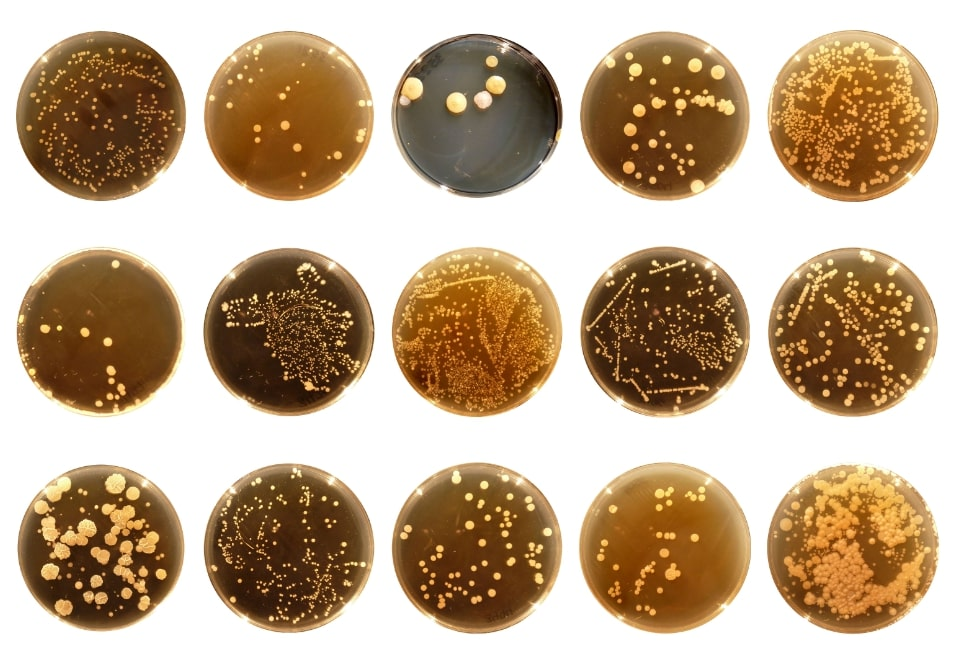
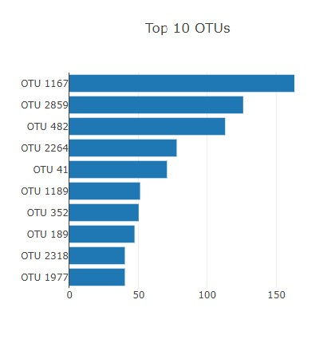
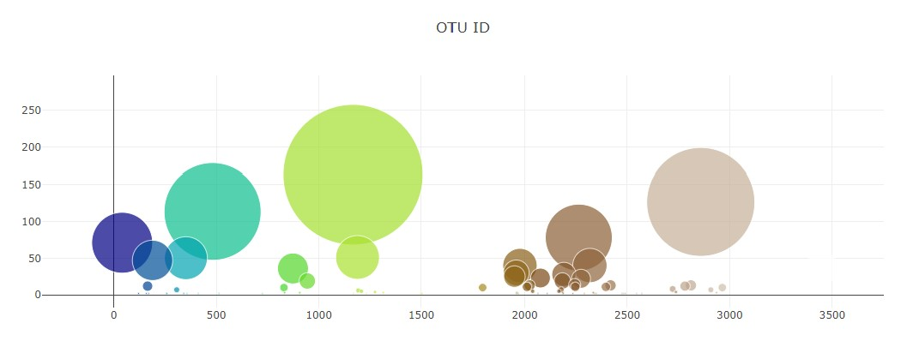
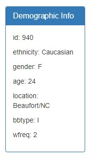

<h1>Belly Button Challenge</h1>

 
<h3><u>Description</u></h3>

In this repository, JavaScript and the D3.js library was used to build an interactive dashboard to explore the Belly Button Biodiversity dataset, which catalogs the microbes that colonize human navels.

The dataset reveals that a small handful of microbial species (also called operational taxonomic units, or OTUs, in the study) were present in more than 70% of people, while the rest were relatively rare.

 
<h3><u>Instructions</u></h3>
 

🦠 Use the D3 library to read in samples.json from the URL https://2u-data-curriculum-team.s3.amazonaws.com/dataviz-classroom/v1.1/14-Interactive-Web-Visualizations/02-Homework/samples.json
 
 

🦠 Create a horizontal bar chart with a dropdown menu to display the top 10 OTUs found in that individual.

<ol><li>Use sample_values as the values for the bar chart.</li>
<li>Use otu_ids as the labels for the bar chart.</li>
<li>Use otu_labels as the hovertext for the chart.</li>
</ol>

 

🦠 Create a bubble chart that displays each sample.

<ol><li>Use otu_ids for the x values.</li>
<li>Use sample_values for the y values.</li>
<li>Use sample_values for the marker size.</li>
<li>Use otu_ids for the marker colors.</li>
<li>Use otu_labels for the text values.</li>
</ol>
 
 

🦠 Display the sample metadata, i.e., an individual's demographic information.
 
 
 

🦠 Display each key-value pair from the metadata JSON object somewhere on the page.
 
 

----------------------------------------------------------
 
 

Thank you for reading!
 
 
<h3>🔬🔬🔬</h3>
 

This was the most challenging assignment to date for me; I was very reliant on the bootcamp tutors and ChatGPT to help me build the framework, and unpack each step along the way./

 

Dataset and image sourced from http://robdunnlab.com/projects/belly-button-biodiversity/

 
